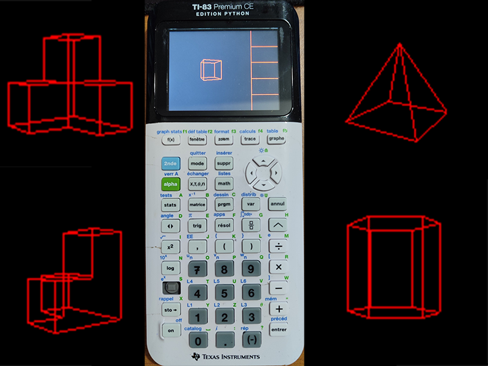

# Moteur-3D-TI-83-PCE
Moteur 3D TI-83 PCE programmé en language assembleur pour le ez80

<pre>
Le fichier assembleur est <3d_renderer_black_and_red.ez80>
le fichier compilé prêt à envoyer sur la calculatrice est <TEST.8xp>
</pre>

